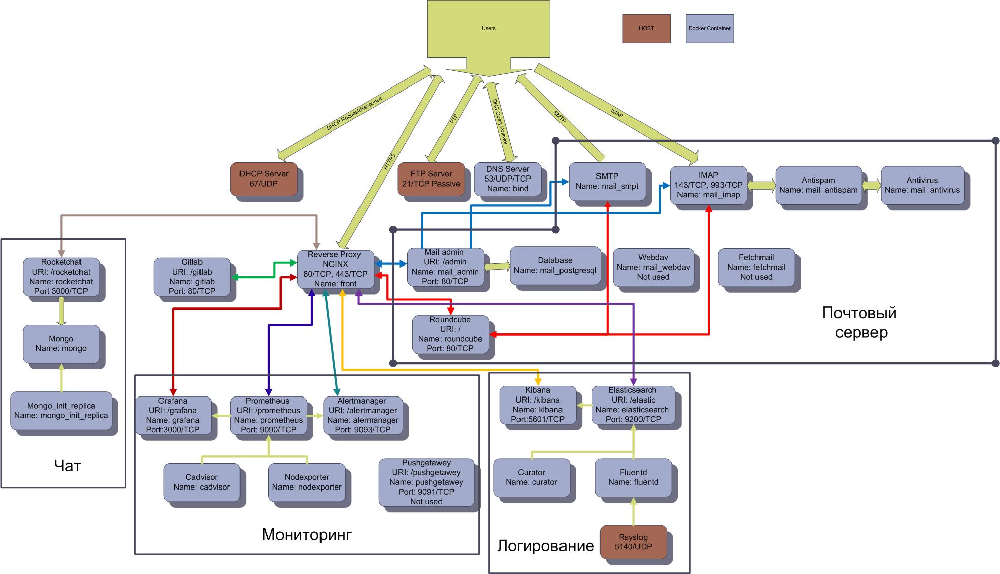

# Automatic server initialization

Install fully operational department server with firewall, dns server, mail server, ftp server, chat, gitlab, EFK stack for logging, Prometheus/Grafana for monitoring with Ansible and Docker-Compose.

:warning: **This version work only with Ubuntu Server/Dekstop**

## Contents

1. [Requirements](#requirements)
   * [Host](#host)
   * [Ansible](#ansible)
   * [Docker](#docker)
2. [Server overview](#server-overview)
3. [General principles](#general-principles)
   * [Configure](#configure)
   * [Deploy](#deploy)
4. [Usage](#usage)
   * [Network setup](#network-setup)
   * [Services deploy](#services-deploy)
5. [Variables](#variables)
   * [Host Variables](#host-variables)
   * [Network Variables](#network-variables)
   * [SSH Variables](#ssh-variables)
   * [Iptables Variables](#iptables-variables)
   * [Docker Variables](#docker-variables)
   * [DHCP Variables](#dhcp-variables)
   * [FTP Variables](#ftp-variables)
   * [DNS Variables](#dns-variables)
   * [Services deploy variables](#services-deploy-variables)
6. [Services configuration definition](#services-configuration-definition)
   * [FTP Config](#ftp-config)
   * [DHCP Config](#dhcp-config)
   * [DNS Config](#dns-config)
   * [Services Config](#services-config)
      * [EFK - Logging](#efk-logging)
        * [Elasticsearch](#elasticsearch)
        * [Curator](#curator)
        * [Fluentd](#fluentd)
        * [Kibana](#kibana)
      * [Rocketchat](#rocketchat)
      * [Monitoring](#monitoring)
        * [Prometheus](#prometheus)
        * [Grafana](#grafana)
        * [Alertmanager](#alertmanager)
        * [NodeExporter](#nodeexporter)
        * [Cadvisor](#cadvisor)
      * [Mail](#mail)
        * [Admin panel](#admin-panel)
        * [Nginx - Reverse Proxy](#nginx-reverse-proxy)
      * [Gitlab](#gitlab)
7. [Services integration](#services-integration)
   * [Gitlab - Mail](#gitlab-mail)
   * [Gitlab - Rocketchat](#gitlab-rocketchat)
   * [Alertmanager - Rocketchat](#alertmanager-rocketchat)
8. [Links to services manual](#links-to-services-manual)

## Requirements

### Host

* 4 Processor core
* 8 GB of RAM

:exclamation: *Make sure your user has the [required permissions][linux-postinstall] to interact with the Docker daemon.*

The services exposes the following ports by default:

* 53(udp/tcp): DNS port
* 80:          Standart HTTP port
* 443:         Standart HTTPs port
* 25:          SMTP port
* 110:         POP3 port
* 143:         IMAP port
* 465:         SMTPS port
* 587:         STARTTLS port
* 993:         IMAPS port
* 995:         POP3 port

### Ansible

* [Ansible](https://docs.ansible.com/ansible/latest/installation_guide/intro_installation.html) verison **2.8** or newer

### Docker

* [Docker Engine](https://docs.docker.com/install/) version **17.05** or newer
* [Docker Compose](https://docs.docker.com/compose/install/) version **1.20.0** or newer

## System Overview

Схема сервера представлена снизу на рисунке:

Все сервисы, кроме **Rsyslog**, **FTP** и **DHCP** развернуты в контейнерах Docker. Присутствует 5 логических блоков сервисов:

* Мониторинг
* Логирование
* Почтовый сервис
* Сервер контроля версий и CI/CD
* Чат

Мониторинг позволяет контролировать численнные параметры контейнеров и хоста, а также получать оповещения о чрезвычайных событиях. Подробнее смотри [далее](#monitoring).
Логирование позволяет агрегировать сообщения от контейнеров и хоста, визуализировать и анализровать журнал событий. Подробнее смотри [далее](#efk-logging).
Почтовый сервис позволяет организовать обмен сообщениями электронной почты, а также получать оповещения о событиях внутри сервера. Подробнее смотри [далее](#mail).

Все сервисы, общающиеся со внешним миром по протоколам HTTP/HTTPS, находятся за обратным прокси-сервером, который отвечает за инкапсуляцию сервисов от внешней сети и снятия протокола шифрования TLS. Во внутренней сети для ускорения обмена все коммуникации используют нешифрованное соединение.

## General Principles

### Configure

Для автоматизации настройки и развертывания программного обеспечения необходимого для работы сервера используется **Ansible**. Все задачи в **Ansible** делятся на роли(roles) по своей функциональности. Роли затем объединяются в плэйбуки(playbook). Для развертывания сервера применяются две роли:

* `dep7server_prepare` - отвечает за настройку параметров сетевого подключения
* `dep7server_playbook` - отвечает за настройки и развертывание сервисов

Для настройки необходимых служб и демонов необходимы права пользователя root, соответственно все плейбуки выполняются от имени пользователя root хоста. Что бы не вводить пароль суперпользователя при каждом запуске роли и для безопасного хранения пароля используется механизм [Ansible Vault][ansible-vault]. Зашифрованный пароль суперпользвателя хоста хранится в файле `dep7server_vault.yml`

В файле `inverntories/prod_server/hosts.yml` находятся общие переменные хоста которые нужно задать:
| Name       | Default Value | Description |
|------------|---------------|-------------|
|`ansible_host`| -             | Host IP address or domain name|
|`ansible_user`| -             | OS User     |
|`ansible_ssh_private_key_file`| -           | Path to SSH private key
|`ansible_python_interpreter`| /usr/bin/python3 | Path to Python3

В своей работе Ansible использует SSH соединение. По умолчанию настройки SSH сервера хоста позволяеют установить соединение с правами суперпользователя при введении пароля. Такая практика считается небезопасной. Необходимо настроить SSH сервер хоста на отклонение соединения по паролю и с правами суперпользователя и осуществления соединения только по ключу. Для этого в плейбуке `dep7server_playbook` происходит настройка SSH сервера. Публичный ключ находится в папке `roles/copy_ssh_key/files`

Подробное описание переменных используемых при настройке и развертывании сервисов сервера приведено в соответсвующих разделах.

### Deploy

Для развертывания сервисов используется **Docker**. Все сервисы сервера разворачиваются в своих контейнерах. Кроме **Gitlab** все контейнеры разделяют философию:
> Один процесс - один контейнер.

Файл развертывания сервисов генерится с помощью **Ansible** из шаблона.

## Usage

### Network setup

По умолчанию утилитой отвечающей за сетевые подключения в ОС семейства Ubuntu является **Netplan**. Задать настройки сетевого подлкючения необходимо при установке системы. В случае необходимости смены настроек сетевого подключения при конфигурации сервера используется Ansible роль `dep7server_prepare`.  

Настройки сети задаются в файле `inventories/prod_server/host_vars/dep7server.yml` в разделе **Network configuration**

В утилите **Netplan** конфигурация задается в JSON формате. Для задания конфигурации ознакомьтесь с [инструкцией][netplan-config].

Выполните плэйбук для установки настроек сетевого подключения:

```console
ansible-playbook dep7server_prepare.yml -i inventories/prod_server/hosts.yml --ask-pass --ask-vault-pass
```

### Services deploy

Развертывание сервисов производится при выполнение плейбука `dep7server_playbook`.

```console
ansible-playbook dep7server_playbook.yml -i inventories/prod_server/hosts.yml --ask-pass --ask-vault-pass
```

На целевом хосте производися скачиваение заданных контейнеров с сервисами, настройка конфигурационных файлов и папок для данных. Также производится настройка SSH сервера для доступа только заданных непривилегированных пользователей только ключу. Поэтому ключ `--ask-pass` при последующих запусках необходимо убрать.
После успешного выполнения плэйбука можно приступать к использованию сервисов.

## Variables

### Host Variables

[См. выше](#configure)

### Network Variables

[См. выше](#configure)

### SSH Variables

Находятся в файле `inventories/prod_server/host_vars/dep7server.yml` в разделе **#ssh config**
| Name       | Default Value | Description |
|------------|---------------|-------------|
|`sshd_use_pam`| no  |  PAM authentication
|`sshd_password_authentication`| no | Password_authentication
|`sshd_challenge_response_authentication`| no | [RedHat Explanation][RedHat-ssh]
|`sshd_permitroot_login`| no | SSH root login

### Iptables Variables

Находятся в файле `inventories/prod_server/host_vars/dep7server.yml` в разделе **#Firewall config**
| Name       | Default Value | Description |
|------------|---------------|-------------|
|`firewall_allowed_tcp_ports`| - | List of allowed input tcp port|
|`firewall_allowed_udp_ports`| - | List of allowed input udp port|

### Docker Variables

Переменная `docker_users` содержит список имен пользователей от имени которых можно запускать Docker. Подробнее [см.](https://docs.docker.com/engine/install/ubuntu/)

### DHCP Variables

Находятся в файле `inventories/prod_server/host_vars/dep7server.yml` в разделе **#DHCP settings**

| Name       | Default Value | Description |
|------------|---------------|-------------|
|`def_lease_time`| 600         | The amount of time in minutes or        seconds a network device can use an IP Address in a network.|
|`max_lease_time`| 7200         |The maximum lease time defines the longest lease that the server can allocate.|
|`subnet`        | 192.168.1.0  | DHCP network subnet|
|`subnet_net_mask`| 255.255.255.0| DHCP network subnet mask|
|`start_address` | 192.168.1.110| DHCP start address|
|`end_address`   | 192.168.1.220| DHCP end address|
|`router_address`| 192.168.1.1  | Getaway address in DHCP network|
|`dns_address`   | 192.168.1.1  | DNS address in DHCP network|

### FTP Variables

Находятся в файле `inventories/prod_server/host_vars/dep7server.yml` в разделе **#ftp ssl cert**

| Name       | Default Value | Description |
|------------|---------------|-------------|
|`rsa_cert_file`:       | -    | path to ftp cert file|
|`rsa_private_key_file`:| -    | path to ftp private key file|

Список пользователей разделенных по правам доступа находится в зашифрованном с помощью [Ansible Vault][ansible-vault] виде в файле `role/set_up_ftp/var/main.yml` в виде:

```console
group1:
  - name: User
    password: Pass
    ....

group2:
  - name: User2
    password: Pass2
```

### DNS Variables

Находятся в файле `inventories/prod_server/host_vars/dep7server.yml` в разделе **# DNS Server settings**

| Name                       | Default Value        | Description |
|----------------------------|----------------------|-------------|
|`bind_conf_dir`             | -                    | Path to folder with bind config on *host*|
|`bind_config`               | -                    | Path to bind config file on *host*
|`bind_zone_dir_docker`      | -                    | Path to bind zone file in *docker container*|
|`bind_dir_docker`           | -                    | Path to folder with bind config in *docker container*|
|`bind_log`                  | -                    | Path to bind log file in *docker container*
|`bind_zone_file_mode`       | -                    | Zone file permission
|`bind_allow_query`          | [`any`]              | A list of hosts that are allowed to query this DNS server. Set to ['any'] to allow all hosts
|`bind_listen_ipv4`          | any                  | Listen ipv4 address
|`bind_listen_ipv6`          | any                  | Listen ipv6 address
|`bind_acls`                 | -                    | A list of hosts that are allowed to query this DNS server. Set to ['any'] to allow all hosts
|`bind_forwarders`           | 8.8.8.8              | A list of name servers to forward DNS requests to.|
|`bind_recursion`            | no                   | Allow recursion
|`bind_query_log`            | -                    | A dict with fields file (e.g. data/query.log), versions, size, when defined this will turn on the query log|
|`bind_other_logs`           | -                    | A list of logging channels to configure, with a separate dict for each domain, with relevant details|
|`bind_check_names`          | -                    | Check host names for compliance with RFC 952 and RFC 1123 and take the defined action
|`bind_zone_master_server_ip`| -                    | (Required) The IP address of the master DNS server. If host ip is different that this address DNS server configured as **slave**|
|`bind_zone_minimum_ttl`     | -                    | Minimum TTL field in the SOA record.
|`bind_zone_ttl`             | -                    | Time to Live field in the SOA record.
|`bind_zone_time_to_refresh` | -                    | Time to refresh field in the SOA record.
|`bind_zone_time_to_retry`   | -                    | Time to retry field in the SOA record.
|`bind_zone_time_to_expire`  | -                    | Time to expire field in the SOA record.
|`bind_zone_domains`         | -                    | A list of domains to configure, with a separate dict for each domain, with relevant details|
| `- allow_update`           | `['none']`           | A list of hosts that are allowed to dynamically update this DNS zone. |
| `- also_notify`            | -                    | A list of servers that will receive a notification when the master zone file is reloaded.|
| `- create_forward_zones`   | -                    | When initialized and set to `false`, creation of forward zones will be skipped (resulting in a reverse only zone)|
| `- create_reverse_zones`   | -                    | When initialized and set to `false`, creation of reverse zones will be skipped (resulting in a forward only zone)|
| `- delegate`               | `[]`                 | Zone delegation. See below this table for examples.|
| `- hostmaster_email`       | `hostmaster`         | The e-mail address of the system administrator for the zone|
| `- hosts`                  | `[]`                 | Host definitions. See below this table for examples.|
| `- ipv6_networks`          | `[]`                 | A list of the IPv6 networks that are part of the domain, in CIDR notation (e.g. 2001:db8::/48) |
| `- mail_servers`           | `[]`                 | A list of dicts (with fields `name` and `preference`) specifying the mail servers for this domain.|
| `- name_servers`           | `[ansible_hostname]` | A list of the DNS servers for this domain.|
| `- name`                   | `example.com`        | The domain name |
| `- networks`               | `['10.0.2']`         | A list of the networks that are part of the domain |
| `- other_name_servers`     | `[]`                 | A list of the DNS servers outside of this domain.|
| `- services`               | `[]`                 | A list of services to be advertised by SRV records|
| `- text`                   | `[]`                 | A list of dicts with fields `name` and `text`, specifying TXT records. `text` can be a list or string.|
| `- naptr`                  | `[]`                 | A list of dicts with fields `name`, `order`, `pref`, `flags`, `service`, `regex` and `replacement` specifying NAPTR records.|

### Services deploy variables

Находятся в файле `inventories/prod_server/host_vars/dep7server.yml` в разделе **#Service config**

| Name                       | Default Value        | Description |
|----------------------------|----------------------|-------------|
|`docker_subnet`             | 172.19.0.0/16        | Subnet used for docker containers |
|`keep_logs_day`             | 2                    | A number of days to keep logs |
|`chat_admin_name`           | admin                | Rocketchat admin name|
|`chat_admin_pass`           | changeme             | Rocketchat admin password|
|`chat_admin_mail`           | -                    | Rocketchat admin email|
|`elastic_pass`              | changeme             | Elasticsearch password -user - 'elastic'|
|`ELK_VERISON`               | 7.8.0                | ELK/EFK stack version|
|`gitlab_external_url`       | -                    | Gitlab external URL|
|`SECRET_KEY`                |                      | Mail server Secret Key. Must be change at every setup and randomly generated|
|`domain`                    | -                    | Mail domain
|`hostnames`                 | -                    | Mail server hostname
|`sitename`                  | -                    | Sitename - Displayed at admin panel
|`website`                   | -                    | Website - Displayed at admin panel
|`mail_admin_name`           | -                    | mail admin name - first part of email **example**@example.com
|`mail_admin_mailhost`       | -                    | mail admin mail domain - second part of email example@**example.com**
|`mail_admin_pass`           | -                    | mail admin password

## Services configuration definition

### FTP Config

FTP сервер сконфигурирован для работы в пассивном режиме. Доступ по имени пользователя и паролю. Анонимный доступ запрещен.
Используется шифрование TLS 1.2. Ключ шифрования и сертификат можно задать свой добавив в папку `roles/set_up_ftp/files`. Для пассивного соединения заплатированны порты 50000 - 60000 TCP.

### DHCP Config

[См. выше](#dhcp-variables)

### DNS Config

В качестве DNS сервера используется контейнер с установленным внутри **BIND9**.  Конфигурационные файлы располагаются в папке `bind/etc`. В папке `bind/lib` расположен кэш и файлы логов. Также логи выводятся в стандартный вывод контейнера, откуда их собирает для анализа EFK стек. Файл конфигурации, а также файлы прямой и обратной зоны генерятся Ansible автоматически исходя из [заданных переменных](#dns-variables). Описание работы и способов конфигурации DNS сервера **BIND9** можно прочитать на официальном сайте <https://bind9.readthedocs.io/en/latest/>

### Services Config

#### EFK - Logging

##### Elasticsearch

**Elasticsearch** - это симбиоз NoSQL базы данных с поисковой системой на базе полнотекстового поиска Lucene с возможностью распредленного размещения. Основное применение - это хранение, агреггирование и индексации журнала сообщений. Сообщения журналируются как от хоста, так и от всех Docker контейнеров.
**Elasticsearch** не удаляет данные, поэтому для удаления устаревших логов используется контейнер [curator](#curator), который удаляет логи через заданное количество дней.
По умолчанию **Elasticsearch** ожидает данные по адресу <http://elasticsearch:9200> в сети Docker. В файле конфигурации `roles/docker-compose_add/files/service_conf/logging/elasticsearch/config/elasticsearch.yml` можно задать имя кластера и адрес на котором **Elasticsearch** будет ожидать логи.
Собирается контейнер **Elasticsearch** с помощью *Dockerfile* `roles/docker-compose_add/files/service_conf/logging/elasticsearch/Dockerfile`. По умолчанию берется базовый официальный образ. При желании можно добавить нужные плагины.

##### Curator

Curator применяется для удаления индексов **Elasticsearch**. Контейнер с Curator собирается на базе образа Alpine 3.8. Конфигурируется подключения к **Elasticsearch** в файле настроек `roles/docker-compose_add/files/service_conf/logging/extensions/curator/config/curator.yml`. Настраивается название контейнера с **Elasticsearch**, порт, а также способ авторизации. В файле `roles/docker-compose_add/files/service_conf/logging/extensions/curator/config/delete_log_files_curator.yml` расположены правила. В разделе `filters` описывается правила удаления индексов - в первом разделе указывается паттерн поиска по регулярным выражения названия индекса для удаления, во втором разделе указываются временные единицы от выбранных событий(в данном случае дата создания - creation date), тип единиц(в данном случае дни) и их количество. Все индексы старше выбранного значения будут удалены. Подробнее о конфигурации Curator можно прочитать в [документации][curator-doc]

##### Fluentd

Для сборки логов применяется ПО **Fluentd**. С помощью плагинов **Fluentd** пожетать как забирать логи из файлов, так и получать их по сети в различных форматах. После обработки логи с помощью плагинов могут отправляться в БД, например InfluxDB, или как в нашем случае в **Elasticsearch**. Конфигурация расположена в 3 файла:

* `roles/docker-compose_add/files/service_conf/logging/fluentd/config/fluent-source.conf` - описаны источники логов. В нашем случае источников 2 - лог файлы Docker расположенные на хосте, которые помечаются тегом `docker` и данные передаваемые с помощью rsyslog по протоколу udp по локальной петле на порт 5140. Эти данные получат тег `system`.
* `roles/docker-compose_add/files/service_conf/logging/fluentd/config/fluent-docker.conf` В данном файле производится выделение логов контейнера с NGINX и парсинг его логов, а так же ингориуются логи самого **Fluentd**. Тут же производится смена тегов на более понятные при дальнейшем анализе.
* `roles/docker-compose_add/files/service_conf/logging/fluentd/config/fluentd.conf` - описаны  точки отправки логов в **Elasticsearch**. Выделяются два индекса - `syslog` для логов хоста и `dlog` для логов **Docker**. Также задается формат логов и параметры подключения к **Elasticsearch**.

Запускается **Fluentd** в отдельном контейнера, который создается при запуске из `roles/docker-compose_add/files/service_conf/logging/fluentd/Dockerfile`.
Подробнее о создании настройке **Fluentd** можно узнать из [официальной документации][fluentd-doc]

##### Kibana

**Kibana** применяется для анализа и визуализации логов хранимых в **Elasticsearch**. В файле конфигурации `roles/docker-compose_add/files/service_conf/logging/kibana/config/kibana.yml` указываются параметры подключения к **Elasticsearch**. Собирается контейнер **Kibana** с помощью *Dockerfile* `roles/docker-compose_add/files/service_conf/logging/Kibana/Dockerfile`. Особое внимание стоит обратить на параметр `server.basePath` - в нашем случае **Kibana** находится за обратным прокси и требуется указать новый URI.
По умолчанию берется базовый официальный образ. При желании можно добавить нужные плагины. Подробнее о создании дашбордов можно узнать из [официальной документации][kibana-doc]

#### Rocketchat

**Rocketchat** - средство коммуникации и получения оповещений. Оповещения можно получать при действиях в репозитории Gitlab, при событиях в Alertmanager. Логин доступа к административной панели - `admin`. Пароль `changeme`. Подробнее о настройке **Rocketchat** можно узнать из [официальной документации][chat-doc].

#### Monitoring

##### Prometheus

**Prometheus** - система сбора временных метрик по типу pull. Через заданные промежутки времени она считывает метрики из заданных точек. Основная конфигурация находится в файле `roles/docker-compose_add/files/service_conf/monitoring/prometheus/prometheus.yml`. В настройках можно задать время опроса, файл настроек оповещений, точки сбора данных, а также способ соединения с менеджером оповещения **Alertmanager**. В нашем случае **Prometheus** получает данные из 4 источников

* **NodeExporter** - собирает метрики с ПК хоста. Работает в контейнере
* **Cadvisor** - собирает метрики со всех запущенных контейнеров. Работает также в контейнере.
* **Prometheus** - собирает метрики самого себя
* **Pushgateway** - применяется для получения коротко живущих сообщений которые могут не попасть в интервал сбора метрик. Работает в контейнере. Пока не получает никаких данных. Оставлен на будущее.

В файле `roles/docker-compose_add/files/service_conf/monitoring/prometheus/alert.rules` задаются параметры и их пределы для создания оповещений. По умолчанию прописаны:

* Неработоспособность сервиса мониторинга более 30 секунд
* Высокая нагрузка на процессор хоста - > 1.5
* Количество свободной оперативной памяти меньше 15 %
* Количество свободного места на жестком диске меньше 15%
* Тестовые примеры мониторинга параметров несуществующего контейнера Jenkins. Всегда срабатывают, оставлены для тестирования и примера.

Подробнее о настройке **Prometheus** можно узнать из [официальной документации][prometheus-doc].

##### Grafana

**Grafana** - система визуализации и анализа метрик собранных с помощью **Prometheus**. Настройки источника данных находятся в файле `roles/docker-compose_add/files/service_conf/monitoring/grafana/provisioning/datasources/datasource.yml`
В папке `roles/docker-compose_add/files/service_conf/monitoring/grafana/provisioning/dashboards` находятся примеры дашбоардов для визуализации метрик хоста и докер контейнеров. Эти файлы автоматически подхватываюся **Grafana**. Логин и пароль по умолчанию - `admin`.

Подробнее о настройке **Grafana** можно узнать из [официальной документации][grafana-doc].

##### Cadvisor

**Cadvisor** - система сбора метрик с запущенных контейнеров. Основные настройки представлены в файле `roles/docker-compose_add/templates/docker-compose.yml.j2`.
Получает метрики контейнеров с хоста.

##### NodeExporter

**NodeExporter** - система сбора метрик с хоста. Основные настройки представлены в файле `roles/docker-compose_add/templates/docker-compose.yml.j2`.
Получает метрики непосребственно из ОС хоста.

##### Pushgateway

**Pushgateway** - ПО сбора коротко живущих метрик. Основные настройки представлены в файле `roles/docker-compose_add/templates/docker-compose.yml.j2`.
Пока не используется.

#### Mail

##### Admin panel

В качестве почтового сервера используется сборка **Mailu** построенная на контейнерах **Docker**. Основные настройки представлены в файле `roles/docker-compose_add/templates/mailu.env.j2`. Задаются почтовый домен, имя администратора, его почта и пароль. Включение и отключение модулей антивирус, антиспам. По умолчанию имя администратора - `admin`, e-mail - `admin@dep7serverm.com` , пароль - `changeme`.

##### Nginx - Reverse Proxy

В качестве обратного прокси для всего сервера используется **NGINX** входящий в состав сборки почтового сервера **Mailu**. Связь с внешним миром осуществляется с помощью протокола HTTPS, во внутренней сети действует протокол HTTP. Все сервисы доступны по FQDN сервера плюс соответсвующий URI

* `/rocketchat`
* `/kibana`
* `/elastic`
* `/prometheus`
* `/grafana`
* `/alertmanager`
* `/pushgetaway`
* `/admin`
* `/gitlab`

Подробнее о настройке **NGINX** можно узнать из [официальной документации][nginx-doc].

#### Gitlab

**Gitlab** - система контроля версий и CI/CD инструмент. При первом заходе предлагается создать пароль администратора с логином root. Основные настройки находятся в файле `roles/docker-compose_add/templates/docker-compose.yml.j2`. Указывается внешний URL, настраивается доступ по HTTP([см. выше](#nginx-reverse-proxy)), задаются подключения к почтовому сервису для получения оповещений, отключаются сервисы, для которых есть уже альтернатива, а также отключается получения сертификата Let's Encrypt.

Подробнее о настройке **Gitlab** можно узнать из [официальной документации][gitlab-doc].

## Services integration

### Gitlab - Mail

* Create mail user `gitlab@dep7serverm.com`(or that you defined in gitlab section in `roles/docker-compose_add/templates/docker-compose.yml.j2`) with default password `changeme` (or that defined in gitlab section in `roles/docker-compose_add/templates/docker-compose.yml.j2`)

* Enable **Emails on Push** in Gitlab Web (Project -> Settings -> Integration -> Emails on Push). In **recipient** section enter recipient email.

### Gitlab - Rocketchat

* In Rocketchat create incoming Webhook(Administration -> Integrations -> Incoming -> New)

* Enter `#channel` or `@user`. Enter "Post as" user. Better to select `rocket.chat` or create `gitlab` user. Enable **Webhook** and **script**. Copy-paste JS script from [RocketChat documentation][chat-gitlab] and press "Save". Select webhook URL and copy to clipboard. In Gitlab Web open your project, go to **Setting** -> **Webhook**. Create Webhook. To enable webhook to localhost and internal network in Gitlab Web go to **Administration** -> **Setting** -> **Networks** -> **Outbound requests** and check **Allow requests to local network from webhooks and services**
Enter copied URL from RocketChat. Replace `https` with `http` and URL (`dep7serverm.com/rocketchat`) with `rocketchat:3000`(URL must be like `https://rocketchat:3000/rocketchat/hooks......`). Disable ***SSL Verification**. Your message will be travel only in internal docker network so we dont need TLS encryption. Save and test it.

### Alertmanager - Rocketchat

* Create channel or user or use existing one in RocketChat. Create Incoming Webhook. Enter JS script [from this repos][chat-alertmngr]. In Alertmanager config in **receiver** section enter Webhook URL like in [Gitlab Intergration](#gitlab-rocketchat). Wait for incoming alertt. All message will be tranfered in internal wetwork. No TLS needed.


ALERTMANAGER DOCS!!!!!!

[linux-postinstall]: https://docs.docker.com/install/linux/linux-postinstall/
[ansible-vault]:  https://docs.ansible.com/ansible/latest/user_guide/vault.html
[netplan-config]: https://netplan.io/examples/
[RedHat-ssh]: https://access.redhat.com/solutions/336773
[curator-doc]: https://www.elastic.co/guide/en/elasticsearch/client/curator/5.8/index.html
[fluentd-doc]: https://docs.fluentd.org/
[kibana-doc]: https://www.elastic.co/kibana
[chat-doc]: https://docs.rocket.chat/?gclid=EAIaIQobChMIiNuQ8eaa7AIVCLLtCh3y8QhfEAAYASAAEgIGx_D_BwE
[prometheus-doc]: https://prometheus.io/docs/introduction/overview/
[grafana-doc]: https://grafana.com/grafana/
[nginx-doc]: https://nginx.org/ru/docs/
[gitlab-doc]: https://docs.gitlab.com/
[chat-gitlab]: https://docs.rocket.chat/guides/administrator-guides/integrations/gitlab
[chat-alertmngr]: https://docs.rocket.chat/guides/administrator-guides/integrations/prometheus
